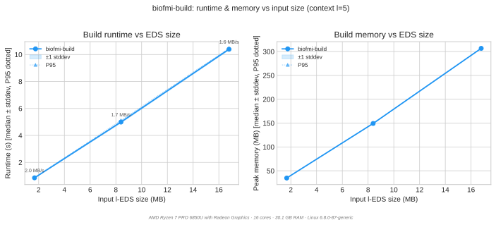
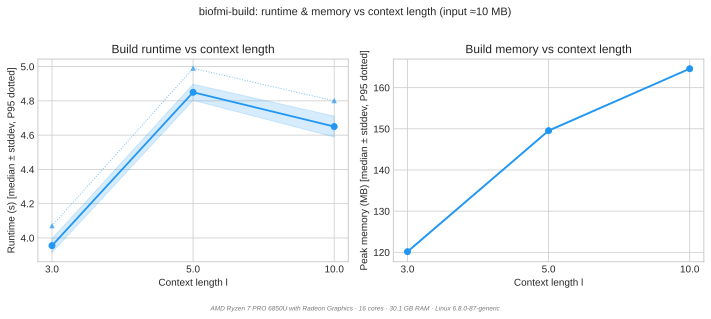
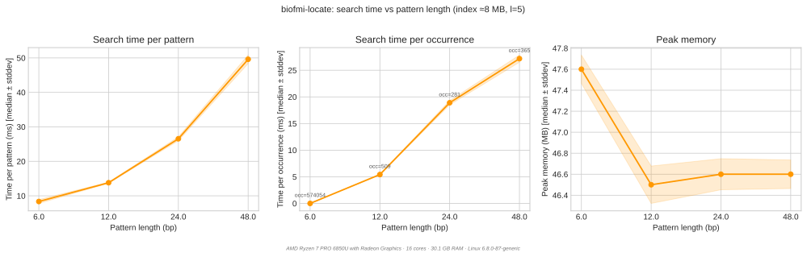
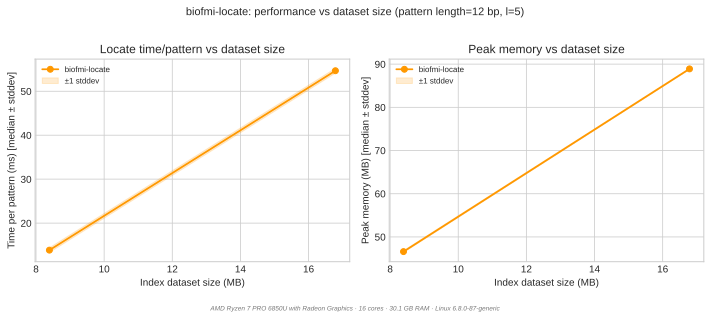

# Benchmarks

BioFMI ships a self-contained benchmark suite in `tests/bench/`. It measures
what building and querying an index **cost in time and memory**, across input
size, context length `l`, pattern length, and dataset size.

!!! note "What this page is, and is not"

    This is a **regression check on this code**, not an evaluation of the
    method. It answers "did this change make the index slower or fatter?" on
    synthetic data that the suite generates itself.

    It does not answer "is a dual FM-index over an l-EDS a good idea?" — that
    needs real pangenomic panels, an occurrence oracle, and a comparison
    against alternatives. That evaluation belongs to the paper, and its harness
    lives outside this repository.

---

## Running it

```bash
cd tests/bench

./bench.sh --size quick       # ~5 min smoke test
./bench.sh                    # ~12 min, the default
./bench.sh --size large       # ~90 min full sweep
```

Each run writes `results/YYYY-MM-DD_HH-MM-SS.csv` and, if `matplotlib` and
`pandas` are installed, plots beside it in `results/plots/<stem>/`.

```bash
python3 bench_plot.py                 # re-plot the newest CSV as PNG
python3 bench_plot.py --format svg    # as SVG — what this page carries
./bench_compare.sh                    # regression check against baseline.csv
```

`bench_compare.sh` exits non-zero if any metric exceeds 120 % of the baseline.
On its first run it bootstraps `results/baseline.csv` from the newest result.

### Which binaries get measured

**The build tree, always** — `build/tools/` before `PATH`, and
`external/edsparser/build/tools/` before `PATH` for the data generators. This
matters more than it sounds: `~/.local/bin` is normally on `PATH`, so the
previous order meant benchmarking whatever was last *installed* rather than the
tree the run was launched from. Set `BIOFMI_TOOLS_FROM_PATH=1` to measure
installed binaries deliberately.

---

## No large data in this repository

The suite generates every panel it needs from a seed, inside a `mktemp -d`
under a trap, and deletes it on exit. **Nothing generated is committed.** The
scale is the reason: a 10 MB reference expands to roughly a 100 MB l-EDS and a
230 MB index, and that is data, not source.

What the repository does carry is small and textual:

| Path | What | Size |
|---|---|---|
| `tests/bench/*.sh`, `bench_plot.py` | the harness | ~45 KB |
| `tests/bench/baseline.csv` | regression anchor | 2 KB |
| `docs/img/bench_*.svg` | the plots on this page | tens of KB |
| `tests/data/` | a small committed sample panel | see below |
| `tests/e2e/data/` | hand-checkable fixtures | < 1 KB |

`.gitignore` enforces this: `*.eds`, `*.leds`, `*.seds`, `*.edz` and
`*.patterns` are ignored everywhere, with narrow exceptions for the committed
fixture directories.

---

## Scenarios

| Scenario | Varies | Held fixed |
|---|---|---|
| `build_size_sweep` | EDS input size | `l = 5` |
| `build_context_sweep` | context length `l` | 5 MB input |
| `locate_pattern_length` | pattern length | 5 MB index, `l = 5` |
| `locate_dataset_size` | index dataset size | `\|P\| = 2(l+1)`, `l = 5` |

Presets:

| Preset | Reps | Build sizes | `l` values | Pattern lengths | Patterns/run |
|---|---|---|---|---|---|
| `quick` | 5 | 1, 5 MB | 5 | 6, 12 | 50 |
| `standard` | 10 | 1, 5, 10 MB | 3, 5, 10 | 6, 12, 24, 48 | 200 |
| `large` | 10 | 5, 25, 50 MB | 3, 5, 10, 20 | 6, 12, 24, 48, 96 | 500 |

!!! warning "Pattern lengths are multiples of `l+1`, not of `l`"

    The chunk size is `l+1`, so `|P|` a multiple of `l+1` is the case the search
    is built for — every chunk is full. Any other length leaves an
    `r = |P| mod (l+1)` tail, which is a far less selective lookup.

    These lists were multiples of `l` until 2026-09-02, with a comment saying so.
    That was correct when the chunk size *was* `l`; the off-by-one fix made it
    `l+1` and the presets were never updated. Every locate benchmark had been
    measuring the tail path without saying so — "pattern length 10" meant one
    full chunk plus a 4-character tail, and the tail dominated the number. See
    [the tail cost table](locate_spec.md#cost-prefer-p-a-multiple-of-l1).

---

## Results

Measured 2026-09-02 with the `standard` preset, N = 10 reps per cell, on:

> AMD Ryzen 7 PRO 6850U · 16 cores · 30 GB RAM · Linux 6.8.0-87 · CPU governor
> `powersave`, temp dir on ext4. The suite warns about both; `performance` and
> `TMPDIR=/dev/shm` reduce jitter. Every plot repeats this footer, so numbers
> from different machines are not silently compared.

Run-to-run spread is small — stddev is under 1.5 % of the median on every build
cell and under 7 % on every locate cell — so the medians below are stable and
differences larger than a few percent are real.

### Building



| l-EDS input | time | peak RSS | s/MB | RSS/MB |
|---:|---:|---:|---:|---:|
| 1.68 MB | 0.86 s | 34.8 MB | 0.51 | 20.7 |
| 8.39 MB | 4.99 s | 149.2 MB | 0.59 | 17.8 |
| 16.79 MB | 10.39 s | 306.6 MB | 0.62 | 18.3 |

Both are linear in the l-EDS, and the memory constant is the one to remember:
**peak build RSS is roughly 18x the l-EDS size**. That is what decides whether a
panel builds at all, and it is why the `l` sweep terminates where it does — the
l-EDS grows with `l`, so the memory wall arrives through the input, not through
the algorithm.



| `l` | l-EDS | time | peak RSS | s/MB |
|---:|---:|---:|---:|---:|
| 3 | 8.28 MB | 3.96 s | 120.2 MB | 0.48 |
| 5 | 8.39 MB | 4.85 s | 149.6 MB | 0.58 |
| 10 | 13.58 MB | 4.65 s | 164.6 MB | 0.34 |

Read this one carefully: **the input is not held fixed**, because it cannot be.
A larger `l` merges more aggressively, so the l-EDS itself grows — 8.28 MB at
`l = 3` against 13.58 MB at `l = 10`. Against that, `l = 10` builds *faster in
absolute terms* than `l = 5` while indexing 62 % more text, so throughput
improves markedly with `l` (0.34 s/MB against 0.58). Larger context windows
produce fewer, longer segments, and the index construction likes that.

### Querying



200 patterns, `l = 5`, 8.4 MB index. `|P|` is a multiple of the chunk size 6, so
every chunk is full and no tail is involved.

| `\|P\|` | chunks | time | per pattern | peak RSS | occurrences |
|---:|---:|---:|---:|---:|---:|
| 6 | 1 | 1.67 s | 8.4 ms | 47.6 MB | 574,054 |
| 12 | 2 | 2.76 s | 13.8 ms | 46.5 MB | 509 |
| 24 | 4 | 5.31 s | 26.6 ms | 46.6 MB | 281 |
| 48 | 8 | 9.92 s | 49.6 ms | 46.6 MB | 365 |

**Cost tracks the chunk count, not the pattern length**, and slightly
sublinearly — 8.4, 6.9, 6.6, 6.2 ms per chunk as the pattern lengthens, because
each additional chunk starts from a smaller surviving candidate set. Memory is
flat: the search state is the candidate map, not the pattern.

The single-chunk row is the interesting one. A 6-character pattern matches
574,054 times against 509 for a 12-character one — over a thousand times more
work returned — and still costs *less* than the two-chunk query. A short pattern
is not expensive because it is short; it is expensive only when the answer is
genuinely enormous. See
[the cost tables](locate_spec.md#pattern-validity) for where that does become
the binding constraint.



200 patterns of length 12, `l = 5`.

| index | time | per pattern | peak RSS |
|---:|---:|---:|---:|
| 8.39 MB | 2.77 s | 13.9 ms | 46.6 MB |
| 16.79 MB | 10.94 s | 54.7 ms | 88.9 MB |

**Memory is linear in the dataset; time is not.** Doubling the index costs 1.9x
the memory but **3.9x the time**, and occurrence count only rose 1.6x, so the
answer size does not explain it. Two points cannot fix an exponent, and this is
the clearest thing in the suite worth a `--size large` run to pin down: if the
trend holds, query cost is closer to quadratic than linear in panel size, which
matters far more for scaling to real pangenomes than anything else measured
here.

---


---

## CSV schema

```
timestamp, preset, scenario, phase, tool,
input_size_mb, context_length,
pattern_length, n_patterns, n_occurrences,   ← empty on build rows
n_reps,
runtime_median_s, runtime_mean_s, runtime_stddev_s, runtime_p95_s, runtime_p99_s,
memory_median_mb, memory_mean_mb, memory_stddev_mb, memory_p95_mb, memory_p99_mb
```

`bench_plot.py` derives three more:

- `throughput_mb_s` = `input_size_mb / runtime_median_s` — build rows
- `time_per_pattern_ms` = `runtime_median_s × 1000 / n_patterns` — locate rows
- `time_per_occurrence_ms` = `runtime_median_s × 1000 / n_occurrences` — locate rows

Every plot carries a footer naming the machine that produced it — CPU, cores,
RAM, OS — so numbers from different machines are not silently compared.

---

## See also

- [`locate()` specification](locate_spec.md) — what a query returns and what a
  short tail costs
- [Index internals](index_internals.md) — where build time and index bytes go
- [CLI reference](cli.md) — `--benchmark` on `biofmi-locate` for per-query timing
